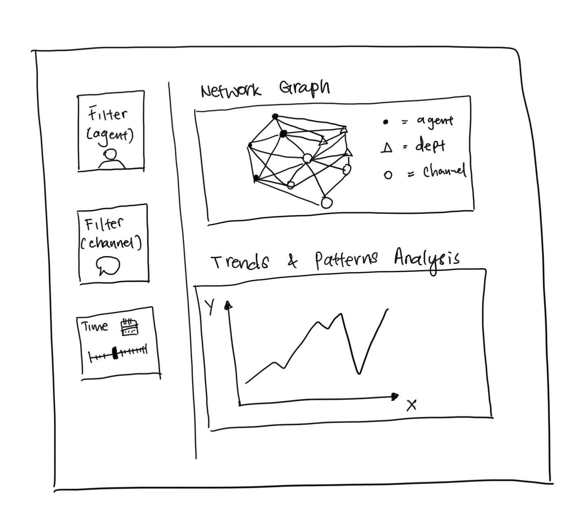

## Motivation

As organizations become more reliant on AI for corporate communication, failures like TenantThread's embargo breach highlight a critical need for oversight. This project pioneers a visual analytics framework to audit AI systems, tracing the logical and behavioral anomalies such as sentiment shifts and system friction that trigger unforeseen failure modes.

## Objectives

This analysis examines the internal communications surrounding TenantThread's embargo breach involving Project HarborCrest. By integrating communication network analysis, behavioural analysis, and text analytics, the study aims to:

1.  Reconstruct the sequence of events, communication pathways, and key relationships that contributed to the inappropriate release of embargo-sensitive information.

2.  Identify behavioural changes, communication roles, and warning signals that emerged prior to the breach by comparing critical-period activities with earlier communication patterns.

3.  Evaluate whether the release was the result of deliberate actions, abnormal agent behaviour, or a breakdown of communication and compliance controls under escalating operational pressure.

### Analytical Questions

• What were the key events and relationships that led to the inappropriate release?

• How did breach-period behaviours differ from normal communication patterns?

• Were there leading indicators that such a release was possible?

• Were there previous occasions where agents behaved differently from expected behaviour?

• Why did earlier warning signals not result in noticeable intervention?

• Did the breach arise from deliberate actions or a breakdown of the communication and compliance system?

## Data

The study uses the communication dataset derived from the VAST Challenge 2026 Mini-Challenge 1 JSON file. After data extraction and transformation, the final dataset contains **912 communication records** and **9 variables.** Each record represents a communication event involving one or more participants within TenantThread's communication ecosystem.

The key variables include communication timestamps, participant identifiers, communication channels, message types, agent roles, recipients, and message contents. These records capture interactions across Legal, PR, Social Media, and Platform Trust functions during the two-week period preceding the inappropriate release of embargo-sensitive merger information.

## Methodology

## Prototype Sketch



## R Packages

The analysis was conducted using a collection of R packages for data wrangling, text analytics, network analysis, visualisation, and reporting. The key packages utilised in this study are summarised below.

::: panel-tabset
### Utility

-   **jsonlite** – Parse and extract communication data from JSON files.
-   **tidyverse** – Data cleaning, transformation, and preparation.
-   **lubridate** – Date and time processing.
-   **knitr** – Dynamic report generation.

### Text Analytics

-   **tidytext** – Tokenisation, TF-IDF, and text mining.
-   **stringr** – Text cleaning and pattern matching.
-   **widyr** – Word co-occurrence and relationship analysis.

### Network Analytics

-   **tidygraph** – Graph data manipulation and network construction.
-   **igraph** – Network metrics and centrality analysis.
-   **ggraph** – Network visualisation.
-   **visNetwork** – Interactive network exploration.

### Visualisation

-   **ggplot2** – Statistical graphics and exploratory visualisation.
-   **ggalluvial** – Flow and pathway visualisation.
-   **ggiraph** – Interactive visualisations with tooltips.
-   **plotly** – Interactive dashboards and charts.
-   **ggrepel** – Improved label placement.
-   **patchwork** – Combining multiple plots into a single layout.

### Reporting

-   **gt** – Publication-quality summary tables.
-   **DT** – Interactive data tables.
-   **kableExtra** – Enhanced table formatting.

### Shiny App

<<<<<<< HEAD
-   **shiny** – Build the interactive visual analytics application.
-   **shinydashboard** – Create dashboard layout and navigation.
-   **shinyWidgets** – Add enhanced input controls and filters.
=======
- **shiny** – Build the interactive visual analytics application.
- **shinydashboard** – Create dashboard layout and navigation.
- **shinyWidgets** – Add enhanced input controls and filters.
>>>>>>> 36f8aabb672446799332cd3e4c340392465f8e06
:::

## Project Schedule

```{r}
#| fig-width: 16
#| fig-height: 7
#| out-width: "100%"
#| echo: false

library(tidyverse)
library(lubridate)

# 1. Defined exactly 11 project tasks and matched dates
project_tasks <- tibble(
  task = c(
    "Explore Each Persons' Take Home Exercise 2",
    "Create new Git repo, editing & publishing project proposal",
    "Set up Global layout",
    "Q1 content and design",
    "Q2 content and design",
    "Q3 content and design",
    "Mid sprint catch up after class",
    "Adjustment and UI tweaks",
    "Final Check-in and adjustments",
    "Poster Preparation (Due 4th July)",
    "Estimated Final Submission: App, Website & Peer Evaluation (Due 5 July)"
  ),
  start_date = ymd(c("2026-06-09", "2026-06-10", "2026-06-12", 
    "2026-06-14", "2026-06-14", "2026-06-14", "2026-06-19", 
    "2026-06-20", "2026-06-28", "2026-06-30", "2026-07-03"
  )),
  end_date   = ymd(c("2026-06-10", "2026-06-12", "2026-06-14", 
    "2026-06-19", "2026-06-19", "2026-06-19", "2026-06-20", 
    "2026-06-30", "2026-07-01", "2026-07-04", "2026-07-04"
  ))
)

# 2. Set dynamic factor levels
project_tasks <- project_tasks %>%
  mutate(task = factor(task, levels = rev(task)))

# 3. Plot the Gantt Chart with Chronological Gradient Mapping
ggplot(project_tasks, aes(ymin = start_date, ymax = end_date, x = task, color = as.numeric(end_date))) +
  geom_linerange(linewidth = 10) + 
  coord_flip() + 
  scale_y_date(
    date_breaks = "1 day",    
    date_labels = "%d %b",    
    limits = c(ymd("2026-06-09"), ymd("2026-07-06")) # FIXED: Shifted back to June 9 to capture the 1st row
  ) +
  scale_color_gradient(low = "#4393c3", high = "#b2182b") + 
  labs(
    title = "Visual Analytics Project Timeline & Milestones",
    subtitle = "Color gradient shifting toward the final delivery rush in July",
    x = NULL,
    y = "Timeline (June - July 2026)"
  ) +
  theme_minimal(base_size = 11) +
  theme(
    plot.title = element_text(face = "bold", size = 14),
    plot.subtitle = element_text(color = "gray30", size = 10),
    panel.grid.minor = element_blank(),
    legend.position = "none", 
    axis.text.y = element_text(face = "bold", color = "black", size = 9),
    axis.text.x = element_text(angle = 90, vjust = 0.5, hjust = 1, size = 8, face = "bold")
  )
```
