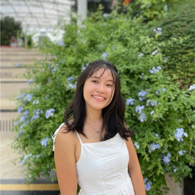

## TenantThread: Embargo Breach Investigation


This project is based on **Mini-Challenge 1 of VAST Challenge 2026**.

TenantThread is a property technology company whose automated communication system released embargoed merger information before the official announcement deadline. The case focuses on **Project HarborCrest**, a confidential merger agreement between TenantThread and CivicLoom Realty Partners.

Through this project, we develop a visual analytics application to explore the communication patterns, agent behaviours, and key events leading up to the embargo breach.

For the detailed project objectives and proposed approach, please refer to the **Proposal** section.

## About Us

```{=html}
<style>
.about-team {
  max-width: 900px;
  margin: 30px auto 65px auto;
}

.about-team-row {
  display: grid;
  grid-template-columns: repeat(3, 1fr);
  gap: 28px;
  text-align: center;
  align-items: start;
}

.about-team-photo {
  width: 210px;
  height: 210px;
  object-fit: cover;
  object-position: center;
  border-radius: 50%;
  border: 8px solid #c9003b;
  display: block;
  margin: 0 auto;
}

.about-team-names {
  display: grid;
  grid-template-columns: repeat(3, 1fr);
  gap: 28px;
  background-color: #f7f7f7;
  margin-top: 18px;
  padding: 8px;
  text-align: center;
}

.about-team-name {
  color: #24364b;
  font-family: Georgia, serif;
  font-size: 1.25rem;
}

.about-team-emails {
  display: grid;
  grid-template-columns: repeat(3, 1fr);
  gap: 28px;
  margin-top: 10px;
  text-align: center;
}

.about-team-icon {
  color: #24364b;
  font-size: 1.35rem;
  line-height: 1.1;
  margin-bottom: 3px;
}

.about-team-email {
  color: #24364b;
  font-family: Georgia, serif;
  font-size: 1rem;
  line-height: 1.15;
  overflow-wrap: anywhere;
}

.about-team-email a {
  color: #24364b;
  text-decoration: underline;
}

/* Mentor */
.mentor-section {
  max-width: 900px;
  margin: 55px auto 40px auto;
  padding-top: 0;
  text-align: center;
}

.mentor-section h2 {
  margin-bottom: 20px;
}

.mentor-photo {
  width: 360px;
  max-width: 100%;
  height: auto;
  display: block;
  margin: 0 auto 18px auto;
}

.mentor-role {
  color: #667085;
  font-size: 0.95rem;
  margin-bottom: 8px;
}

.mentor-button {
  display: inline-block;
  margin-top: 18px;
  padding: 10px 18px;
  background-color: #3155E7;
  color: white !important;
  border-radius: 6px;
  text-decoration: none;
  font-weight: 600;
}

/* Phone layout */
@media (max-width: 700px) {
  .about-team-row,
  .about-team-names,
  .about-team-emails {
    grid-template-columns: 1fr;
    gap: 22px;
  }

  .about-team-names {
    background-color: transparent;
    padding: 0;
  }

  .about-team-name {
    background-color: #f7f7f7;
    padding: 8px;
  }
}
</style>
```

::::::::::::::: about-team
::: about-team-row



:::

:::::: about-team-names
::: about-team-name
Alvin Ong
:::

::: about-team-name
Javier Phang
:::

::: about-team-name
Michelle Chen
:::
::::::

::::::::: about-team-emails
:::: about-team-email
::: about-team-icon
✉
:::

<a href="mailto:alvin.ong.2024@mitb.smu.edu.sg">alvin.ong.2024\@mitb.smu.edu.sg</a>
::::

:::: about-team-email
::: about-team-icon
✉
:::

<a href="mailto:javierphang.2024@mitb.smu.edu.sg">javierphang.2024\@mitb.smu.edu.sg</a>
::::

:::: about-team-email
::: about-team-icon
✉
:::

<a href="mailto:michelle.c.2024@mitb.smu.edu.sg">michelle.c.2024\@mitb.smu.edu.sg</a>
::::
:::::::::
:::::::::::::::

::::: mentor-section
## Our Mentor

[{.mentor-photo}](https://faculty.smu.edu.sg/profile/kam-tin-seong-486)

### [Professor Kam Tin Seong](https://faculty.smu.edu.sg/profile/kam-tin-seong-486)

::: mentor-role
Associate Professor of Information Systems (Practice)
:::

::: mentor-role
School of Computing and Information Systems, Singapore Management University
:::

<a class="mentor-button" href="https://faculty.smu.edu.sg/profile/kam-tin-seong-486" target="_blank">View Faculty Profile</a>
:::::
